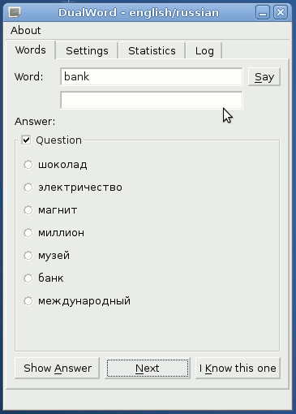
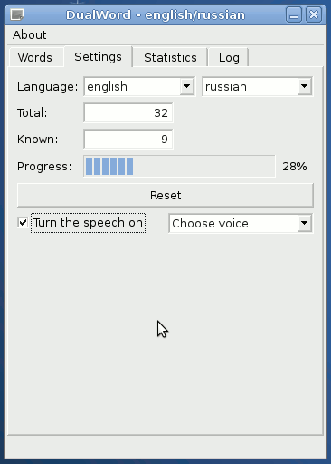
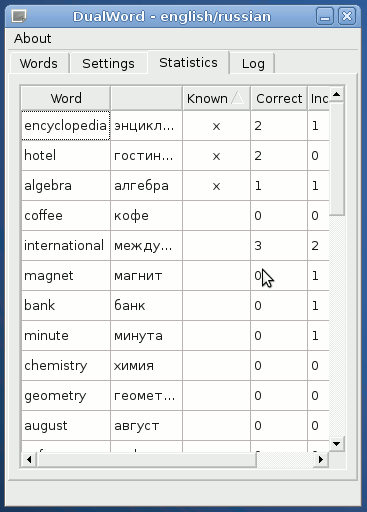
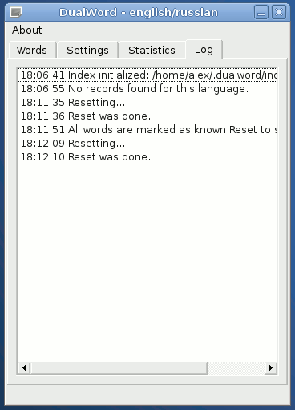
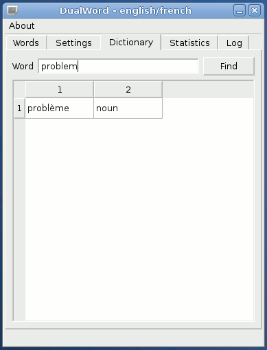

DualWord is a foreign language vocabulary trainer for Linux.  

Features include:  
 - Single choice questions.  
 - Text to speech support.  
 - User statistics.  
 - Languages: English, German, French, Spanish, Russian.  

Third Party Software:  
 - Qt 4.8.6 License: LGPL v2.1  
 - Xapian 1.2.12 License: GNU General Public License  

License: GNU GENERAL PUBLIC LICENSE Version 3  
Source code: https://github.com/dualword/dualword  

&nbsp;
&nbsp;
&nbsp;
&nbsp;
&nbsp;

